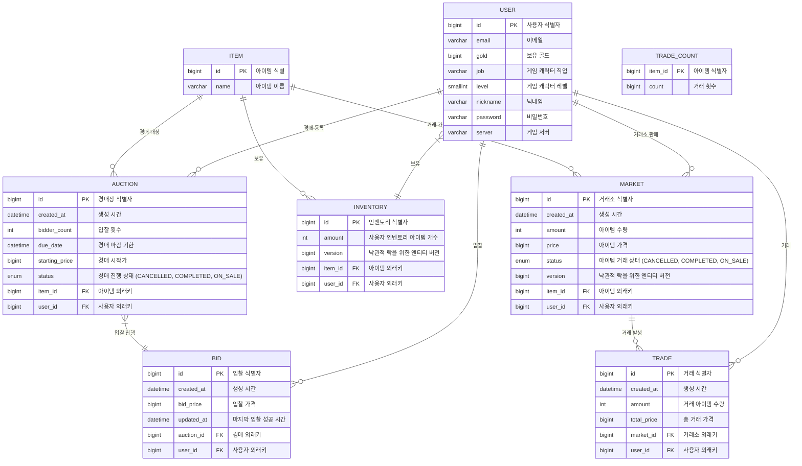

# 🛍️ Market Normalization 🛍️

## 💻 프로젝트 소개
- 특정 가상의 게임을 대상으로 한 게임 아이템 거래 플랫폼
- 사용자가 아이템을 자유롭게 거래하거나 경매하는 서비스 제공 
- 진행 기간: 2025/01/31 ~ 2025/02/07

## 🛠️ 기술 스택

### Back
&nbsp;
&nbsp;
&nbsp;
&nbsp;
&nbsp;
&nbsp;
&nbsp;
&nbsp;
&nbsp;

### Tool
&nbsp;
&nbsp;
&nbsp;

## 🔗 ERD

## 📋 주요 기능
### 1. 사용자 관리
- 로그인
- 유저 프로필 조회
- 거래 및 경매 내역 조회

### 2. 거래 시스템
- 판매 등록/거래/판매 취소
- 인기 거래 아이템 조회

### 3. 경매 시스템
- 경매 등록/경매에 입찰/경매 취소
- 경매 종료 자동화
- 인기 경매 아이템 조회

## 🔍 핵심 서비스 소개
### 1. 실시간 거래소 시스템
- Redis를 활용한 동시성 제어

### 2. 실시간 경매장 시스템
- JPA 비관적 락을 활용하여 동시성 제어 
- 스케줄러를 활용하여 30초마다 마감일이 지난 경매 상태를 '마감(COMPLETED)'으로 자동 변경 

## 🎯 성능 개선

📌 1. 조회 성능 개선 

**문제점**

조회 성능이 매우 느림↓ ➜ 초기 거래소 조회 속도: **36.8초** 

**개선 과정**

1. **1차 개선**
    - ⏳ 36.8초 ➜ 🚀 **24.17초**
    - ⚡ **12.63초** 단축

   **개선 내용**
    - **tradeCount** 집계 테이블 생성
    - **tradeCount** 테이블의 `count`에 인덱스 생성 (ASC)
    - 거래소 `status`와 `createdAt` 복합 인덱스 생성
    - **trade** 테이블의 `createdAt` 인덱스 생성 (DESC)

   **문제점**  
   - 인덱스가 너무 많고, **trade** 테이블에 인덱스가 있어 삽입 시 오버헤드 우려됨  
   - **trade**는 삽입이 활발히 일어나는 항목이므로 해당 부분에 대한 개선이 필요함

---
2. **2차 개선**
    - ⏳ 24.17초 ➜ 🚀 **3.6초**
    - ⚡ **20.57초** 단축

   **개선 내용**
    - 커서 기반 페이지네이션 적용
    - 정렬 전략 별로 다른 cursor 사용
    - tie-breaker로 `itemId` 사용
    - (status, createdAt, itemId, amount, price) 복합 인덱스 생성 
      - 이전처럼 인덱스를 많이 사용하기보다 하나의 인덱스로 성능을 개선함

   **문제점**
    - `market` 삽입 시 오버헤드를 고려할 필요가 있으나, **trade**보단 빈도가 덜할 테니 상대적으로 괜찮다고 판단됨

---
3. **3차 개선**

   **3-1. 풀텍스트 인덱스 적용**
   - ⏳ 3.6초 ➜ 🚀 **0.039초**
   - ⚡ **3.561초** 단축

   **개선 내용**
   - CustomFunctionContributor 이용하여 풀텍스트 인덱스(Full-Text Index) 적용

  **3-2. 느린 쿼리 최적화 (거래소 인기내역)**
   - ⏳ 26.7초 ➜ 🚀 **0.035초**
   - ⚡ **26.665초** 단축 

  **개선 내용**
   - Redis 캐싱을 이용하여 성능 향상
   - 인기 내역은 변동성이 적기 때문에 TTL을 꽤 길게 가져감
   - DB 부하 감소
     - 느린 쿼리로 인한 DB 트래픽 줄여줌
   
  **향후 개선 목표**
   - 현재 해결책은 임시 방편임 
   - `cursor`와 `tie-breaker`를 넣어주면 그나마 속도가 빠르지만, 인기 내역 첫 로드 시 조회속도가 매우 느림
   - 원인을 찾지 못하였기에 추후 생각날 때마다 개선 예정
  

  

📌 2. 동시성 제어 

**문제점**

한 경매에 여러 입찰이 동시에 이루어졌을 때 교착상태(deadlock) 발생↓

.png)

**개선 과정**

- **대안 비교**
   - **선택 사항**
     - 1안: 비관적 락 
     - 2안: 낙관적 락 
   - **테스트 조건**
      - 입찰 요청 총 개수: **100개**
      - 스레드: **20개**
    - **테스트 과정**
      - 1안 및 2안을 각각 비즈니스 로직에 적용 후 테스트 코드 실행
      - 이후 `속도`, `발생한 예외 개수` 등등 비교
   - **테스트 결과**

- **결정 및 근거**
  - **1안 `비관적 락` 적용**
  - **근거**
    - 경매 및 거래는 동시에 사용자가 몰리기 때문에 충돌이 자주 발생함 
    - 속도 면에서는 낙관적 락이 우세하나, CustomException 외에 예상치 못한 예외가 너무 발생함 
    - 경매와 거래는 속도보다 데이터 정확도가 정말 중요하기 때문에 비관적 락을 적용하기로 결정함

## 🏆 서비스 최종 성능 정리 
- queryDSL을 활용한 동적 조회 구현
- 조회 성능 개선 
  - 커서 기반 페이지네이션, 풀텍스트인덱스, redis caching 활용 
  - **평균 17배 속도 단축**

## 📝 API 명세서
### 1. 사용자 API
| Method | URI                    | Request Body       | Request Parameters | Path Variables | Response Code | Description  |
|--------|------------------------|--------------------|--------------------|----------------|---------------|--------------|
| POST   | /auth/login            | `email` `password` |                    |                | 200           | 게임 아이디로 로그인  |
| GET    | /users/my-profile      |                    |                    |                | 200           | 본인 프로필 조회    |
| GET    | /user/history/markets  |                    |                    |                | 200           | 본인의 거래 목록 조회 | 
| GET    | /user/history/trades   |                    |                    |                | 200           | 본인의 거래 단건 조회 | 
| GET    | /user/history/auctions |                    |                    |                | 200           | 본인의 경매 내역 조회 |
| DELETE | /auth/logout           |                    |                    |                | 204           | 로그아웃         |

### 2. 거래소 API
| Method | URI                 | Request Body              | Request Parameters | Path Variables | Response Code | Description      |
|--------|---------------------|---------------------------|--------------------|----------------|---------------|------------------|
| POST   | /markets            | `itemId` `price` `amount` |                    |                | 201           | 판매할 아이템 등록       |
| POST   | /markets/trades     | `itemId` `amount`         |                    |                | 200           | 거래소에 등록된 아이템 구매  |
| GET    | /markets/{itemId}   |                           | `                  | `itemId`       | 200           | 특정 아이템의 거래 목록 조회 | 
| GET    | /markets/populars   |                           |                    |                | 200           | 인기 아이템 조회        |
| DELETE | /markets/{marketId} |                           |                    | `marketId`     | 200           | 거래 취소            |

### 3. 경매장 API
| Method | URI                   | Request Body                           | Request Parameters                                                                              | Path Variables | Response Code | Description     |
|--------|-----------------------|----------------------------------------|-------------------------------------------------------------------------------------------------|----------------|---------------|-----------------|
| POST   | /auctions             | `itemId` `startingPrice` `auctionDays` |                                                                                                 |                | 201           | 경매 등록           |
| GET    | /auctions/main        |                                        | `lastAuctionId` `searchKeyword` `sortBy` `sortDirection` `lastStartPrice` `lastCurrentMaxPrice` |                | 200           | 마감 전 경매 검색 및 조회 |
| GET    | /auctions/{auctionId} |                                        | `                                                                                               | `auctionId`    | 200           | 경매 단건 조회        | 
| GET    | /auctions/populars    |                                        | `lastBidderCount` `lastAuctionId`                                                               |                | 200           | 인기 아이템 조회       |
| PATCH  | /auctions/bids        | `auctionId` `bidPrice`                 |                                                                                                 |                | 200           | 경매에 입찰          |
| DELETE | /auctions/{auctionId} |                                        |                                                                                                 | `auctionId`    | 200           | 경매 취소           |

## 팀원
|  |  |  |  |
| :---------------------------------------------------------------------------------------: | :---------------------------------------------------------------------------------------: | :---------------------------------------------------------------------------------------: | :---------------------------------------------------------------------------------------: |
|[강세민](https://github.com/KangSemin)|[신지현](https://github.com/backswan0)|[이우진](https://github.com/gkdl4239)|[이채영](https://github.com/roqkfchqh)|
